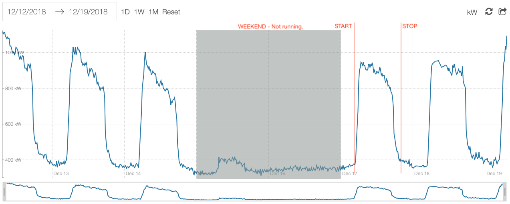
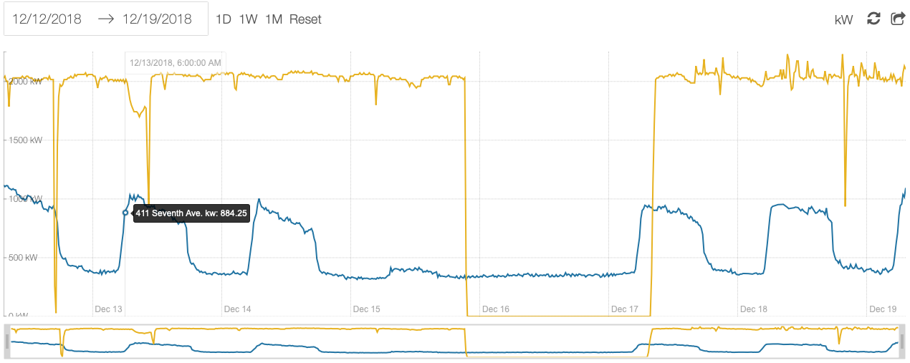
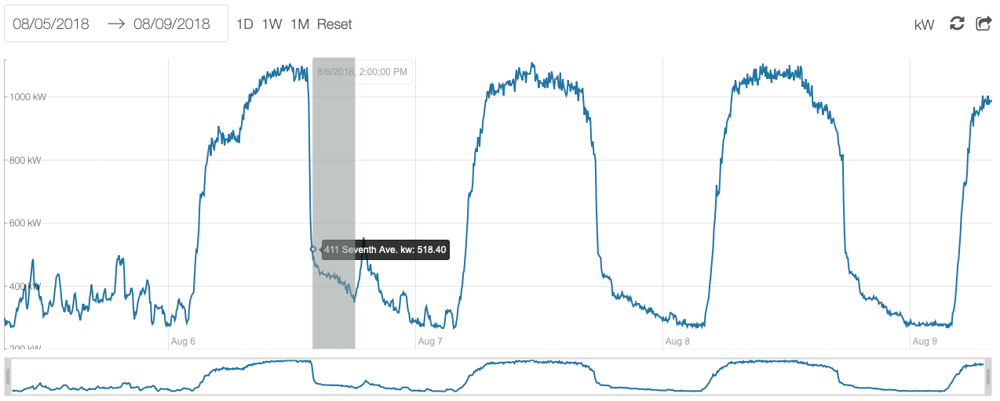

# Programming Assignment: Load Analysis

## Index

- [The Dataset](#the-dataset)
- [The Project](#the-project)
- [Extensions](#extensions)
- [Deliverables](#deliverables)

## The Dataset

You will be provided with a public DSN for a database of customer load data.

The database has a single table, `intervals`, consisting of utility interval load data going back to 2015 for 367 sites, formatted as time series. The table has four columns:

```sql
interval_load_data=> \d intervals
                           Table "public.intervals"
     Column     |            Type             | Collation | Nullable | Default
----------------+-----------------------------+-----------+----------+---------
 kWh            | double precision            |           |          |
 interval_end   | timestamp without time zone |           |          |
 interval_width | integer                     |           |          |
 site_id        | uuid                        |           |          |
Indexes:
    "intervals_interval_end_site_id_idx" btree (interval_end, site_id)
```

- **kWh**: The energy consumed, in kilowatt-hours, during the given interval.
- **interval_end**: The closing timestamp of the interval, in UTC.
- **interval_width**: The width of the interval, in seconds, e.g. 900 = 15 minutes.
- **site_id**: UUID reference to an anonymized site.

### Examples

The following interval means that site **5d41402a-bc4b-2a76-b971-9d911017c592** consumed **15.2 kWh** in the **15 minutes** ending at **12/5/18 8:05:00 UTC**:

```sql
----------------+-----------------------------
 kWh            | 15.2
 interval_end   | '2018-12-05 08:05:00'::timestamp
 interval_width | 900
 site_id        | '5d41402a-bc4b-2a76-b971-9d911017c592'::uuid
```

#### Get data for one site.

```sql
interval_load_data=> select * from intervals where site_id='35f1db19-ab26-7f30-3451-971f053712f6' order by interval_end asc limit 5;
   kWh   |    interval_end     | interval_width |               site_id
---------+---------------------+----------------+--------------------------------------
 1853.28 | 2015-05-15 05:00:00 |            900 | 35f1db19-ab26-7f30-3451-971f053712f6
 1848.96 | 2015-05-15 05:15:00 |            900 | 35f1db19-ab26-7f30-3451-971f053712f6
    1836 | 2015-05-15 05:30:00 |            900 | 35f1db19-ab26-7f30-3451-971f053712f6
 1816.56 | 2015-05-15 05:45:00 |            900 | 35f1db19-ab26-7f30-3451-971f053712f6
 1810.08 | 2015-05-15 06:00:00 |            900 | 35f1db19-ab26-7f30-3451-971f053712f6
(5 rows)
 ```

#### Convert kWh to average kW.

When viewing load data as a time series, it can be more useful to view *demand*, or kW, over *consumption*, or kWh. You can convert back and forth given `interval_width`:

```sql
interval_load_data=> select "kWh"*(3600./interval_width) as "avg_kW", interval_end, interval_width, site_id from intervals where site_id='35f1db19-ab26-7f30-3451-971f053712f6' order by interval_end asc limit 5;
 avg_kW  |    interval_end     | interval_width |               site_id
---------+---------------------+----------------+--------------------------------------
 7413.12 | 2015-05-15 05:00:00 |            900 | 35f1db19-ab26-7f30-3451-971f053712f6
 7395.84 | 2015-05-15 05:15:00 |            900 | 35f1db19-ab26-7f30-3451-971f053712f6
    7344 | 2015-05-15 05:30:00 |            900 | 35f1db19-ab26-7f30-3451-971f053712f6
 7266.24 | 2015-05-15 05:45:00 |            900 | 35f1db19-ab26-7f30-3451-971f053712f6
 7240.32 | 2015-05-15 06:00:00 |            900 | 35f1db19-ab26-7f30-3451-971f053712f6
(5 rows)
```

## The Project

The database has kWh load data for 367 sites. For many sites there is months or years of data; for some there's only a few days. The goal is to identify, for each site, the following information:

1. Daily start time/stop (or flag as continuous process)
2. Potential DR event days by site--a shutdown during normal running hours
3. Data gaps, ID'd by date

### Daily start/stop

Most commercial and industrial (C&I) customers have a daily operating rhythm. The primary goal of this project is to identify that rhythm for the sites in this dataset. An example of a typical commercial site load is shown below.



Some loads do not have a daily rhythm--they run continuously, or only shut down on weekends. An example is shown below, graphed alongside the previous example.



The orange line is a "continuous load", although it shuts down over weekends.

The goals for this part of the challenge are to identify, for every site:

1. Whether they are a "daily" load or a "continuous" load, and
2. If daily, when they typically start and stop running.

### Potential DR Days

Load profiles look different during demand response events. We would like to try to identify past DR events from the load profile. Note that all we can do is identify "potential" events--we won't be able to tell if they shut down for DR or for some other reason. Below is a view of the same site as the first example; Monday 8/6, 2-6PM was a DR event (the grey region).



### Gaps

Finally, we pull data from many sources, including utilities. It is not uncommon for a utility to "miss" some days in the export. During one-off analysis, this is usually easy to catch, but it is challenging at scale. Suppose we define a gap to be **a period of >1hr for which there is no data and which is between min(interval_end) and max(interval_end) for a particular site_id.**

Your challenge is to ID the dates of any gaps for all sites.

## Extensions.

1. Suppose we had access to real-times streaming data for these sites in the same format as this database. How would you implement startup/shutdown detection as an online algorithm?
2. How would you estimate the "downtime load" of a site--the amount of energy they use then they are not operating?

## Deliverables.

Your code should be delivered as a zip file in an email to <engineering+jobs@voltus.co>, with source implementing the analysis and generating all other deliverables. Assume that the output of your code will be run in a production environment.

Your code should:
1. Output some artifact (CSV, database, etc.) answering questions 1, 2, and 3 by `site_id`. If you're unsure of what's acceptable, ping Liz at <ltheurer@voltus.co>.
2. Be readable on its own.
3. Include your preferred language's version of a `requirements.txt` or `package.json` so that someone else can easily duplicate your environment/dependencies.
4. Your code should ***ideally*** include some visual output for visualizing your results against the dataset.
